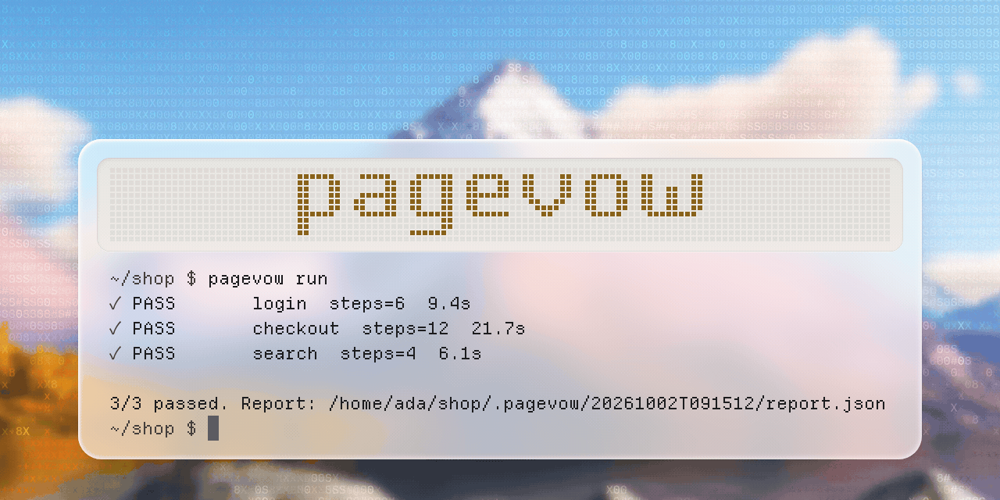
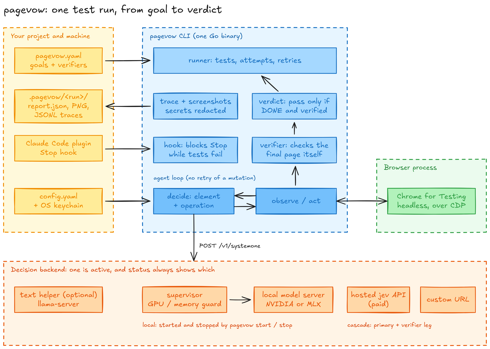

<p align="center"></p>

<h1 align="center">pagevow</h1>

<p align="center">
  <a href="https://github.com/aymaneallaoui/pagevow/actions/workflows/ci.yml"></a>
  <a href="https://github.com/aymaneallaoui/pagevow/releases/latest"></a>
  
  
</p>

pagevow runs browser tests that are written as goals. You say what a person would do on the page and what the page
should show when they're done, and a model drives a real Chromium to get there. I built it because I wanted tests that
read like a task, and because a model saying it finished isn't evidence that it did.

It's one Go binary. There is also a Claude Code plugin that runs your suite when Claude thinks it's done.

## How it differs from selector-based tests

- **A test is a goal.** A start URL, a sentence, and a check on the final page. No selectors in the test file.
- **The model chooses, it doesn't write.** pagevow lists the elements it observed on the page, and the model picks one of them
  plus one of a few operations (`CLICK`, `TYPE_TEXT`, `SELECT`, `PRESS_ENTER`). It never emits a selector or code.
- **`DONE` is not a pass.** A test passes only when the run ended `DONE` and a verifier that reads the final page
  agrees. The verifier doesn't ask the model. A test with no verifier counts as a failure.
- **Evidence and no surprises.** Screenshots and a step trace are kept for every test. The active backend is always
  visible, and `status` and `run` tell you when a paid API would be called.

## Quick start

```sh
pagevow install --browser                       # pinned Chrome for Testing, checked by size and SHA-256
pagevow use custom --url http://127.0.0.1:8080  # or: use jev, use local, use cascade (see Backends)
pagevow init                                    # writes a starter pagevow.yaml
pagevow run
```

A tests file is a YAML list. These are the first two tests of the starter that `pagevow init` writes:

```yaml
- id: home-loads
  url: http://localhost:3000/
  goal: "Open the home page. Stop when the page has finished loading."
  verify: page
  verify_args:
    url: /$
    text: ["Welcome"]

- id: contact-form
  url: http://localhost:3000/contact.html
  goal: "On the contact page, enter name Ada Lovelace and email ada@example.com. Stop when both values are in the form. Do not send."
  tags: [forms]
  verify: page
  verify_args:
    url: /contact\.html
    fields: {Name: Ada Lovelace, Email: ada@example.com}
```

`pagevow run` prints one line per test, the totals, and a block for each test that failed. Piped, it looks like this
(on a terminal each line also gets a mark):

```text
PASS       home-loads  steps=<n>  <seconds>s
FAIL       contact-form  steps=<n>  <seconds>s  attempt 2

1/2 passed. Report: .pagevow/<UTC timestamp>/report.json

FAIL contact-form
  goal: On the contact page, enter name Ada Lovelace and email ada@example.com. ...
  final url: http://localhost:3000/contact.html
  failed checks:
    - <check that failed>
  final.png: .pagevow/<UTC timestamp>/contact-form.retry1/final.png
  directory: .pagevow/<UTC timestamp>/contact-form.retry1
```

`pagevow status` shows the active backend and whether a paid service would be called. `pagevow doctor` checks the setup
and prints a fix for each problem. Never put a password in a goal, because goals end up in traces.

## Install

Releases are built by goreleaser for Linux (amd64, arm64), macOS (Intel, Apple Silicon) and Windows (amd64). The latest
is `v0.2.0`. You don't need an account to download one:

```sh
curl -fsSLO https://github.com/aymaneallaoui/pagevow/releases/download/v0.2.0/pagevow_0.2.0_linux_amd64.tar.gz
curl -fsSLO https://github.com/aymaneallaoui/pagevow/releases/download/v0.2.0/checksums.txt
sha256sum -c checksums.txt --ignore-missing
tar -xzf pagevow_0.2.0_linux_amd64.tar.gz pagevow
```

Put `pagevow` on your `PATH`, for example `sudo mv pagevow /usr/local/bin/`. From source you need Go 1.27 or newer:

```sh
go install github.com/aymaneallaoui/pagevow/cmd/pagevow@latest
```

or in a checkout, `make build` writes `bin/pagevow` and `make install` installs it into `GOBIN`. Archive names, the
browser install, local models and `pagevow update` are in [REFERENCE.md](REFERENCE.md#install).

## How it works

<p align="center"></p>

One test, start to finish:

1. `pagevow run` reads `pagevow.yaml`. For each test it opens a fresh window in Chrome for Testing, with a time limit
   and a step limit.
2. The agent observes the page and lists the elements it can act on. It sends the goal and that list to the decision
   backend, and the answer is one observed element plus one operation, or `DONE` or `BLOCKED`. The agent acts over CDP
   and looks again. A browser mutation is never retried: a retry is a new run from the start URL.
3. When the run ends, the verifier checks the final page: URL, visible text, field values, checked boxes.
4. The test is `PASS` only when the run ended `DONE` and the verifier returned true. Screenshots, `result.json`, the
   step trace and `report.json` go under `.pagevow/<run>/`, with secrets removed from the traces.

The decision model never gets a screenshot. They are for you and for Claude. The diagram source is
[`assets/architecture.excalidraw`](assets/architecture.excalidraw).

## Claude Code plugin and Stop hook

A coding agent can say it's finished while the page is broken. The Stop hook is there to catch that.

```sh
pagevow plugin install      # writes the plugin and registers it with Claude Code
pagevow plugin path         # where it is; pass it to claude --plugin-dir, or run plugin uninstall
```

The plugin has a skill, the slash commands `/pagevow-run` and `/pagevow-init`, and the hook. When Claude tries to stop,
the hook runs the project's tests file and blocks Claude while the tests fail, so it can read the `final.png` files and
fix the app or the test. It blocks twice in a row per session by default (`PAGEVOW_HOOK_MAX_BLOCKS`), skips the run when
the project hasn't changed since the last pass, and `PAGEVOW_HOOK=0` turns it off. It never starts a local model. Run
`pagevow plugin install` again after you upgrade or move the binary, because the hook stores its path.

## Backends

Every backend speaks `POST <url>/v1/systemone` with a bearer key.

| Backend | Where the model runs |
|---|---|
| `local` (default) | a kev model server on this machine; `pagevow start` runs it |
| `jev` | the hosted API at `https://api.typesafe.ai`, which is paid |
| `custom` | any URL you give |
| `cascade` | a primary model checked by a verifier model |

pagevow ships no model: `pagevow install --model` puts your own run directory where the local backend finds it. Keys
are references (`keychain:NAME` or `env:NAME`), never literal values in a config file. Set one with
`pagevow keys set NAME`. When the active backend or the text helper would call a paid service, `status` and `run` say
so. The `TYPE_TEXT` operation needs a text helper, any OpenAI-compatible chat server in `text_helper.url`. Without one
it fails, because pagevow never guesses a field value.

## Everything else

[REFERENCE.md](REFERENCE.md) holds the rest: commands and flags, exit codes, tests file keys and verifiers, run output,
cascade settings, local server modes and GPU limits, the config schema, update mechanics, the hook's exit codes and the
platform matrix. `AGENTS.md` and `CLAUDE.md` hold the rules for changes.

## Development

```sh
make check    # gofmt check, go vet, golangci-lint, go test -race
```

Install the linter with `go install github.com/golangci/golangci-lint/v2/cmd/golangci-lint@v2.14.0`. Tests are offline:
no network, no real browser, no model, no paid API and no real keychain. CI workflows are in
[REFERENCE.md](REFERENCE.md#development).

## Licence

MIT, see [LICENSE](LICENSE). Parts of pagevow are derived from
[browser-use/jev-ultrafast](https://github.com/browser-use/jev-ultrafast), used under the MIT License; see
[NOTICE](NOTICE).
